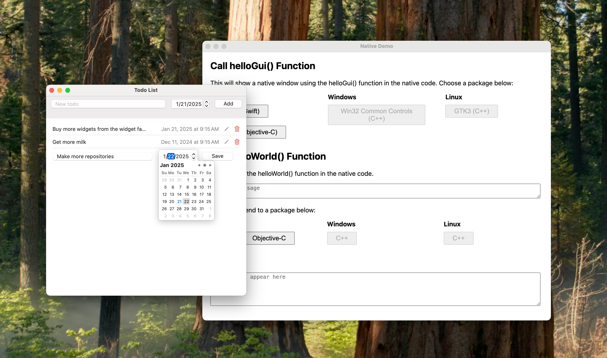
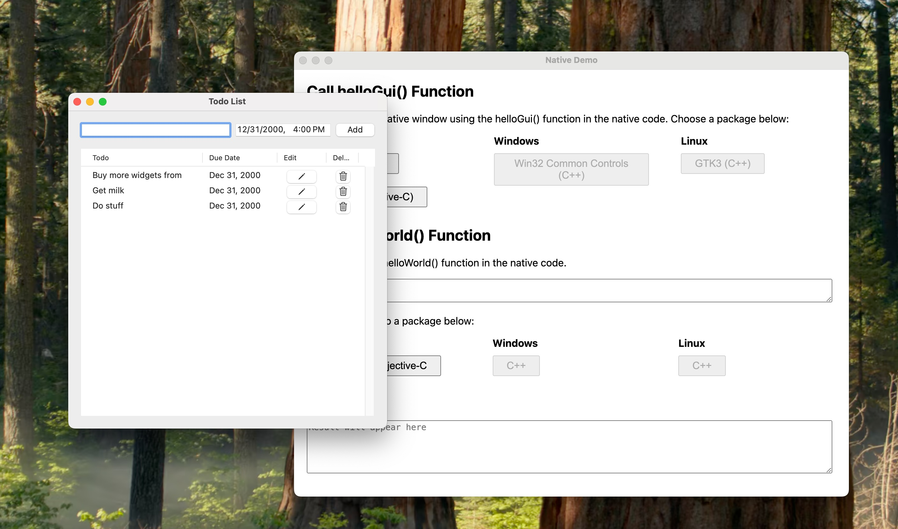
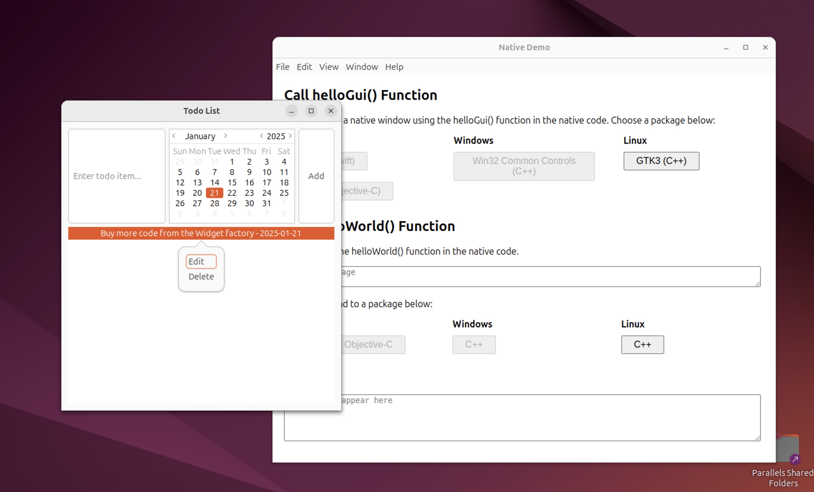
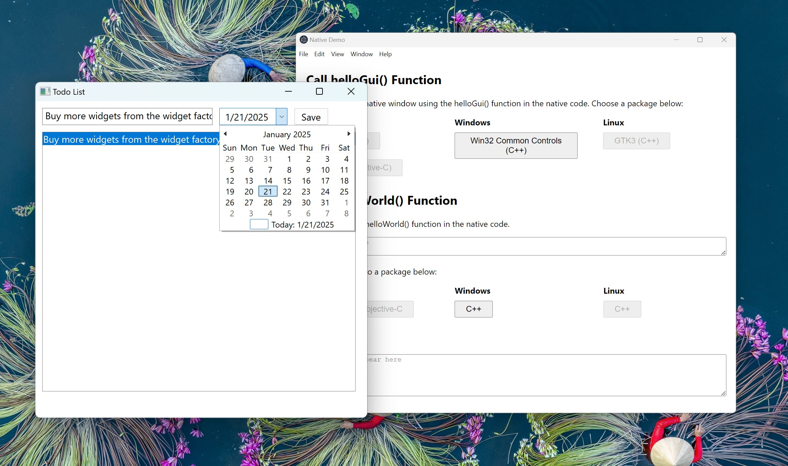

# Electron & Native Code Demos

<p float="left">
  
  
  
  
</p>

This repository demonstrates how you can integrate native code and even native UI elements into your Electron application. It's meant as both a tutorial and as a starting point for you own development. All packages implement:

1. A `helloWorld()` function, taking in and returning a string. It can be called from JavaScript and is executed in native code. Use this as a starting point for simple calls - good examples are calling one specific operating system API.
2. A `helloGui()` function that launches a basic todo editor with all-native controls. Whenever a todo is added, changed, or deleted, an event with details is emitted on the JavaScript side. Use this as a starting point to extend your Electron application with fully native user interfaces.

### Packages

 - `swift`: Uses Swift, SwiftUI, and Foundation. Bridging between JavaScript and Swift is done in Objective-C++.
 - `objective-c`: Uses Objective-C and Cocoa. Bridging between JavaScript and Objective-C is done in Objective-C++.
 - `cpp-win32`: Uses C++ and the `Windows Common Controls` (also known as Win32 API controls) in version 6. Bridging between the JavaScript and the Win32 world is done in C++.
 - `cpp-linux`: Uses C++ and GTK3. Bridging between the JavaScript and the GTK world is done in C++.

To build and run the examples, you can clone this repository and run the basic example app:

```sh
git clone https://github.com/felixrieseberg/electron-native-code-demos
cd electron-native-code-demos
npm i
npm run build
npm run electron
```

# Building a Native Addon for Electron

Native code can be added to your Electron app by building a native [Node.js addon](https://nodejs.org/api/addons.html). Since Electron's main thread is already setup to be running a proper GUI application on all operating systems, writing native addons is comparatively straightforward. This tutorial will be sharing multiple steps before branching off into each specific platform.

## Shared Implementation Details

All the examples can be found in `packages`. All of them share some basics:

### `package.json`

Native Node.js addons are typically normal Node packages, so that you can `require()` them by their name.

### `binding.gyp` & `node-gyp`

This file configures the build system. It's used by `node-gyp`, a port of Google's GYP ("Generate Your Projects") tool. It handles the complex task of compiling C/C++ code across different platforms and Node.js versions and conveniently works on macOS, Windows, and Linux. The configuration file `binding.gyp` is written in a Python-like syntax (actually JSON with comments) and specifies the source files to compile, the include directories, libraries to link, and various platform-specific settings and compilation flags.

When we need to configure Visual Studio's msbuild or Xcode, we will do so in `binding.gyp`.

### `N-API` Layer & Optional Bridge Layer

Every package has an addon file that acts as the N-API layer. For Objective-C, that file is called `objectivec_addon.mm`, while it's called `cpp_addon.cc` in the C++ packages. It performs multiple important jobs:

 - Acts as the bridge between JavaScript/Node.js and native code
 - Handles JavaScript ↔ C++ type conversions
 - Manages event callbacks between native and JavaScript code
 - Uses N-API to ensure ABI (Application Binary Interface) stability

In other words, it is the glue between the Node.js world and the native world. How much "type translation" you need to perform depends on how many types you want to ferry back and forth between the JavaScript world and the native world. This is largely up to you, but the N-API makes this fairly straightforward.

Also, the further your language of choice is "away" from C++, the more you might need an additional bridge layer to expose your higher-level code (say, in Swift or Objective-C) to something lower-level.

You might be wondering: Why add these layers? Is that strictly necessary? While you can cram the same functionality in fewer files and lines of code, I'd caution against it. There are multiple benefits:

#### 1) Separation of Concerns:

```
// N-API Layer (objectivec_addon.mm)
Napi::Value HelloWorld(const Napi::CallbackInfo& info) {
  // Handle JS types and call bridge
  NSString* result = [ObjCBridge helloWorld:nsInput];
}

// Bridge Layer (ObjCBridge.m)
+ (NSString*)helloWorld:(NSString*)input {
  // Handle native implementation
  return [NSString stringWithFormat:@"Hello from Objective-C! You said: %@", input];
}
```

#### 2) ABI Stability:

- N-API provides a stable ABI, meaning addons don't need to be recompiled for different Node.js versions
- Keeping N-API code separate isolates version-dependent code

#### 3) Language Boundaries:

```
// N-API Layer: C++ with Node.js bindings
class ObjectiveCAddon : public Napi::ObjectWrap<ObjectiveCAddon> {
  // JavaScript interface code
}

// Bridge Layer: Pure Objective-C
@interface ObjCBridge : NSObject {
  // Native interface code
}
```

#### 4) Event Handling

```
// N-API Layer: Sets up JavaScript callbacks
[ObjCBridge setTodoAddedCallback:makeCallback("todoAdded")];

// Bridge Layer: Manages native callbacks
static void (^todoAddedCallback)(NSString*);

// UI Layer: Triggers events
[self.delegate todoAdded:jsonString];
```
